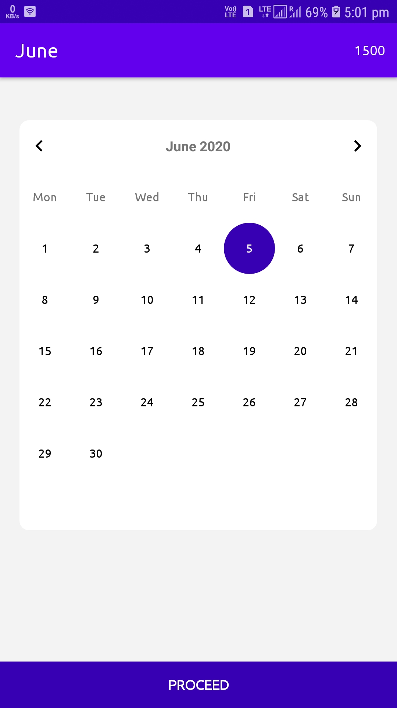
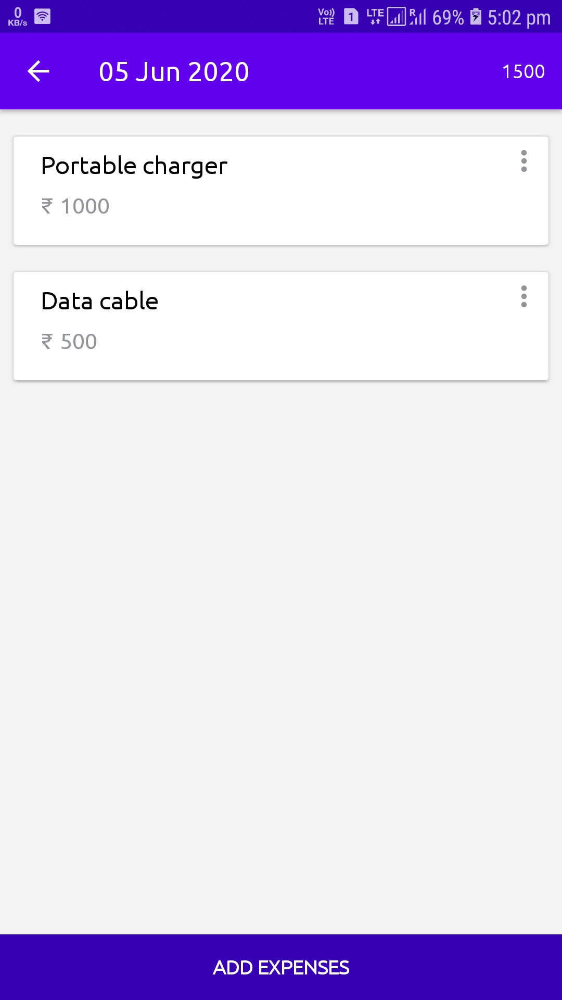
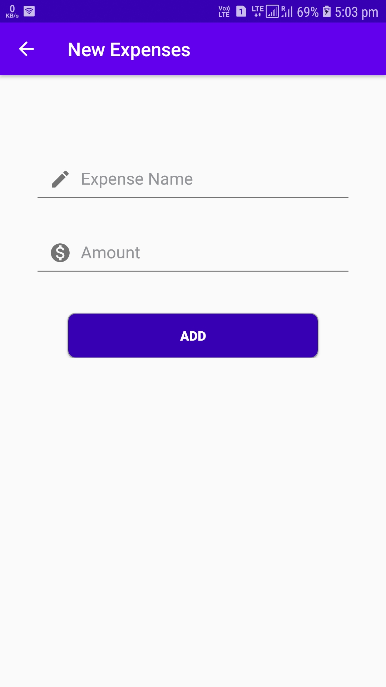

> *This repository contains Android project which is developed for the [**#30DaysOfKotlin**](https://twitter.com/hashtag/30daysofkotlin?lang=en) with Google Developers (Initiative to improve your understanding of Kotlin and apply it in real projects).* 
> Know more about it [here](https://eventsonair.withgoogle.com/events/kotlin).

# CashFlow

[](LICENSE)

This is just a sample app which is built with Kotlin🦸superpower and *Modern Android development* tools! It has below options:

- **Cash Flow:** This is just for fun! :) Here you can keep track of your expenses. 

---

## Preview
<table style="width:100%">
  <tr>
    <th>Home</th>
    <th>List</th>
    <th>Add</th>
  </tr>
  <tr>
    <td></td>
    <td></td>
    <td>
  </tr>
</table>

## Built With 🛠
- ```Kotlin``` - First class and official programming language for Android development.
- ```RecyclerView``` - RecyclerView is a ViewGroup added to the android studio as a successor of the GridView and ListView. It is an improvement on both of them and can be found in the latest v-7 support packages.
- ```Data Class``` -  We frequently create classes whose main purpose is to hold data. In such a class some standard functionality and utility functions are often mechanically derivable from the data. In Kotlin, this is called a data class and is marked as data : data class User(val name: String, val age: Int)
- ```Layout``` - A layout defines the structure for a user interface in your app, such as in an activity. All elements in the layout are built using a hierarchy of View and ViewGroup objects. A View usually draws something the user can see and interact with.
- ```Activity``` - An activity is a single, focused thing that the user can do. Almost all activities interact with the user, so the Activity class takes care of creating a window for you in which you can place your UI with setContentView(View).
- ```Material Components for Android``` - Modular and customizable Material Design UI components for Android

# Credits
---
Thanks to
- ```Android Kotlin Fundementals```- For awesome Codelabs on using Kotlin to build Android apps using best practices


## Contact
If you need any help, you can connect with me. 
 

Visit:- [linktr.ee/dev.codes_](https://linktr.ee/dev.codes_)

## License
```
MIT License

Copyright (c) 2020 Prakash A

Permission is hereby granted, free of charge, to any person obtaining a copy
of this software and associated documentation files (the "Software"), to deal
in the Software without restriction, including without limitation the rights
to use, copy, modify, merge, publish, distribute, sublicense, and/or sell
copies of the Software, and to permit persons to whom the Software is
furnished to do so, subject to the following conditions:

The above copyright notice and this permission notice shall be included in all
copies or substantial portions of the Software.

THE SOFTWARE IS PROVIDED "AS IS", WITHOUT WARRANTY OF ANY KIND, EXPRESS OR
IMPLIED, INCLUDING BUT NOT LIMITED TO THE WARRANTIES OF MERCHANTABILITY,
FITNESS FOR A PARTICULAR PURPOSE AND NONINFRINGEMENT. IN NO EVENT SHALL THE
AUTHORS OR COPYRIGHT HOLDERS BE LIABLE FOR ANY CLAIM, DAMAGES OR OTHER
LIABILITY, WHETHER IN AN ACTION OF CONTRACT, TORT OR OTHERWISE, ARISING FROM,
OUT OF OR IN CONNECTION WITH THE SOFTWARE OR THE USE OR OTHER DEALINGS IN THE
SOFTWARE.
```
